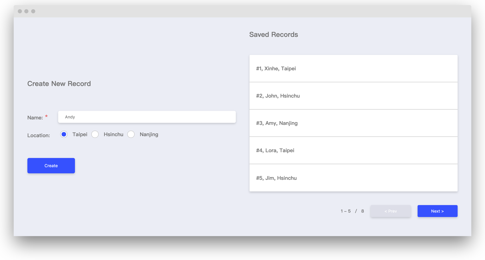
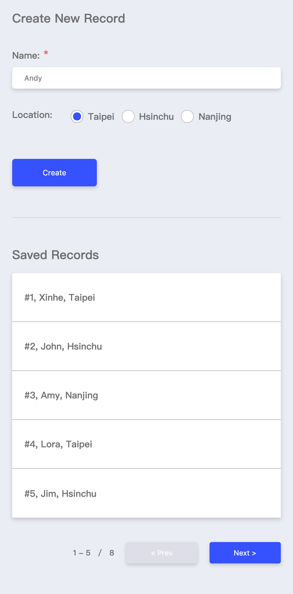

# FED Interview Test for Interns



- ES6 and Webpack4
- BEM naming with SCSS
- EsLint extends Airbnb style guide

## Getting Started
1. Start developing.
    ```
    cd fed-intern-test/
    npm install
    npm start
    ```
2. My App is now running at http://localhost:3000

## Building
```
npm run build
```
The build file will present in the `dist` folder.

## Features
1. Add a record
2. Form validation
3. Pagination
4. delete a record
5. RWD layout
    