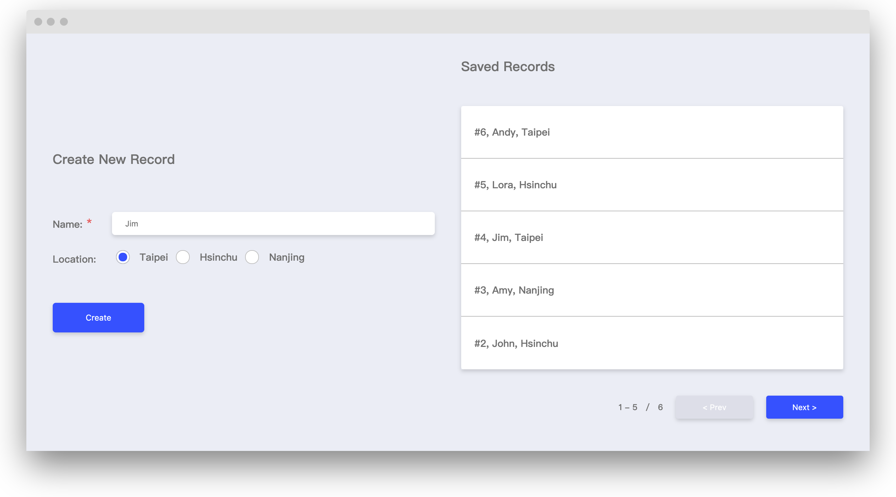
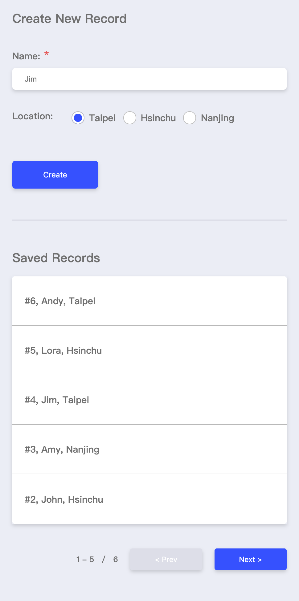

# FED Interview Test for Interns



- ES6, Babel and Webpack4
- BEM naming with SCSS
- EsLint extends Airbnb style guide
- Hot Reloading

## Requirements
- node ^5.0.0
- yarn ^0.23.0 or npm ^3.0.0

## Getting Started
1. Start running the code.
    ```
    cd fed-intern-test/
    npm install
    npm start
    ```
2. My App is now running at http://localhost:3000

## Building
```
npm run build
```
The static file will present in the `dist` folder.

## Project Structure

```
.
├── dist                     # All build-related code
├── js                       
│   └── app.js               # Application entry point
├── styles                   
│   │── abstracts        
│   │    └── _variables.scss
│   │── base        
│   │    └── base.scss
│   │── components        
│   │    │── _buttons.scss
│   │    │── _forms.scss
│   │    │── _inputs.scss
│   │    │── _list-group.scss
│   │    └── _radio-buttons.scss
│   │── pages        
│   │    └── _index.scss
│   │── vendors        
│   │    └── _reset.scss
│   └── app.scss              # Application-wide styles
│── .babelrc                  # Babel config
│── .editorconfig             # Editor preference config
│── .eslintrc                 # EsLint config
│── .gitignore                
│── .prettierrc               # Prettier config
│── index.html                # Main HTML page container for application
│── package.json              
└── webpack.config            # Webpack config
```

## Features
1. Add a record
2. Form validation
3. Pagination
4. delete a record
5. RWD layout
    <br />
    